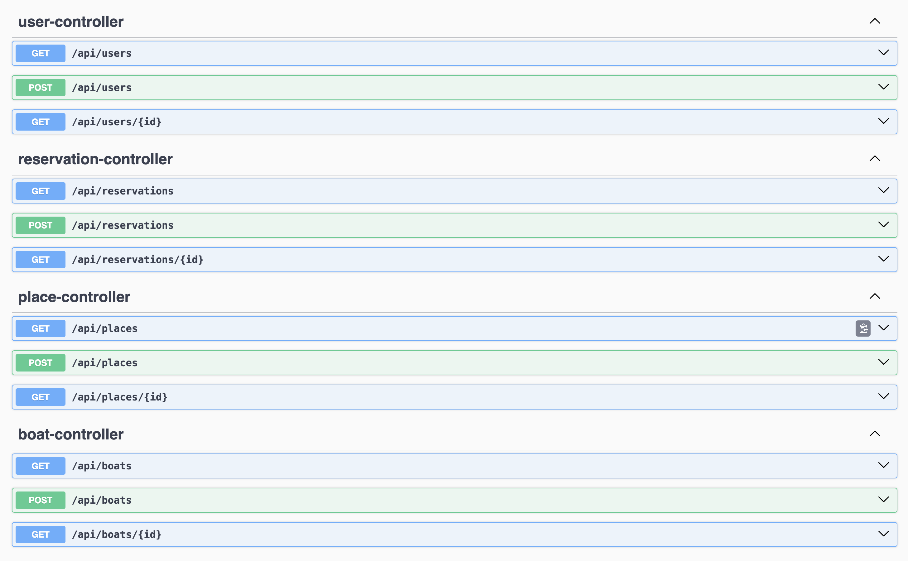

# Port Management App ⚓

Aplikacja webowa do zarządzania portem jachtowym — umożliwia tworzenie rezerwacji miejsc cumowniczych, generowanie raportów oraz zarządzanie użytkownikami.

## Technologie

- Java 17
- Spring Boot 3
- Spring Security
- Spring Data JPA (Hibernate)
- PostgreSQL
- Liquibase
- Maven
- Swagger (OpenAPI)
- JaCoCo (coverage)

## Uruchamianie (Docker)

1. Zbuduj projekt:

```bash
mvn clean package
```

2. Odpal kontenery:

```bash
docker compose up --build
```

3. Aplikacja powinna być dostępna pod:
- `http://localhost:8080`
- Swagger: `http://localhost:8080/swagger-ui/index.html`

## Logowanie

### Użytkownik:
- **Login:** `user1`
- **Hasło:** `password`
- **Rola:** `USER`

### Administrator:
- **Login:** `admin`
- **Hasło:** `password`
- **Rola:** `ADMIN`

Hasła są przechowywane w formacie plain text.

## Endpointy

Dostępne przez Swagger UI:

<!-- screenshot -->


Przykładowe operacje:
- Tworzenie rezerwacji
- Generowanie raportów dla całego pomostu, lub miesięcznych czy rocznych sprawozdań
- Pobieranie dostępnych miejsc
- Rejestracja użytkownika

## Testy i pokrycie

Uruchomienie testów i generowanie raportu pokrycia:

```bash
mvn clean test jacoco:report
```

Raport znajdziesz pod:

```
target/site/jacoco/index.html
```

<!-- screenshot -->


Pokrycie: 82%

---

## Baza danych

Zarządzana przez **Liquibase**, inicjalizacja danych testowych odbywa się automatycznie na starcie.

<!-- screenshot -->


---

## Ukończone funkcjonalności

- [x] Tworzenie i walidacja rezerwacji
- [x] Generowanie raportów dziennych i miesięcznych (faktury)
- [x] Dostęp tylko po autoryzacji (Security)
- [x] Swagger z pełnym dostępem
- [x] Role użytkowników (USER / ADMIN)
- [x] Liquibase zamiast Flyway

---

## Projektowe wzorce

W projekcie zastosowano m.in.:

- **Strategy** – do generowania różnych typów raportów
- **Polimorfizm** – również do stworzenia różnnych typów raportów
